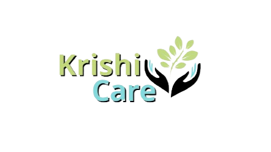

<br>
<p align="center">
    
  </a>
</p>

<p align="center">
<b>#Better Crops, Better Life </b>
</p>

## Table of Contents

- [Problem Statement](#problem-statement)
- [Description of Project](#description-of-project)
- [Top Features](#top-features)
- [Design](#design)
- [Tech-stack used](#techstack-used)
- [Contributors](#contributors)

## Problem Statement

**College Name: Vellore Institute of Technology**

## Description of Project

India is predominantly an agricultural country. Farming is a major occupation in India and one of the biggest challenges which comes when a huge workforce is occupied is that it becomes very difficult to provide personal attention to every farmer. To help the farmers improve in agricultural sector, we propose a web-based application "कृषि Care". Through the web-app we provide online tele-consultation services as well as offline alternatives for consultation to farmers. They can get support in various agricultural activities, by the help of consultants as well as connect with their peers through the web.

## Running the Project

Run the following commands (dev build)
You can skip creating a virtual environment if there are errors.

```sh
python -m venv venv
./venv/Scripts/Activate.ps1
python -m pip install -r requirements.txt

```

Next

```sh
python manage.py collectstatic
python manage.py makemigrations
python manage.py migrate --sync-db
python manage.py createsuperuser 
python manage.py runserver
```

Project developed by - [Team - KrishiCare]()
